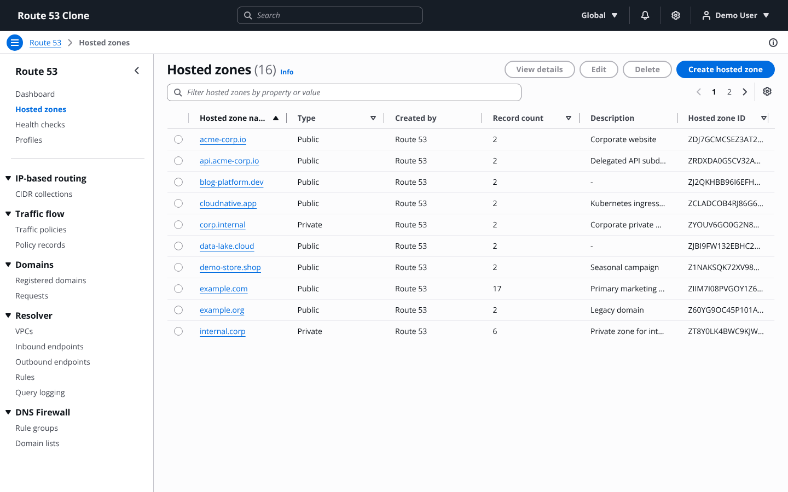
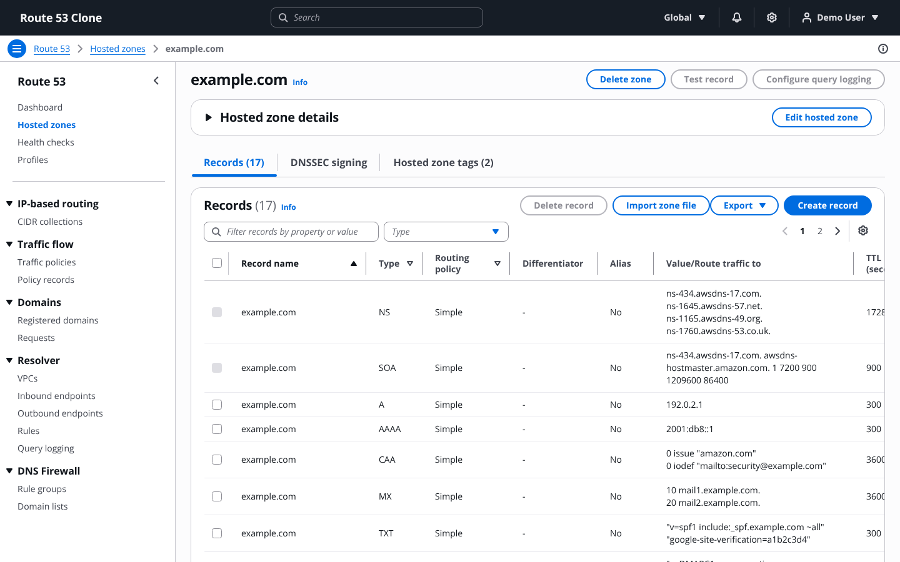
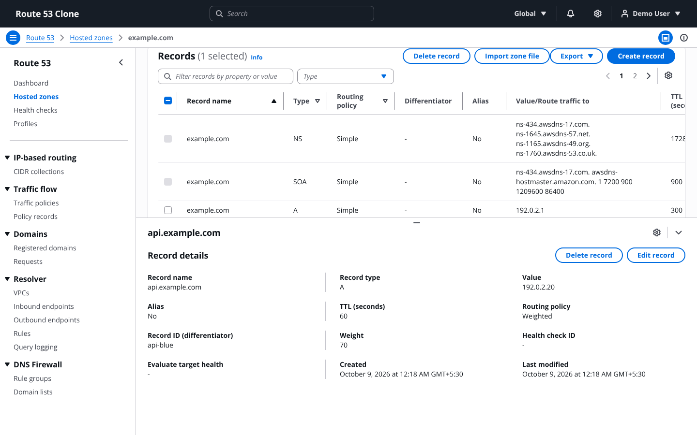
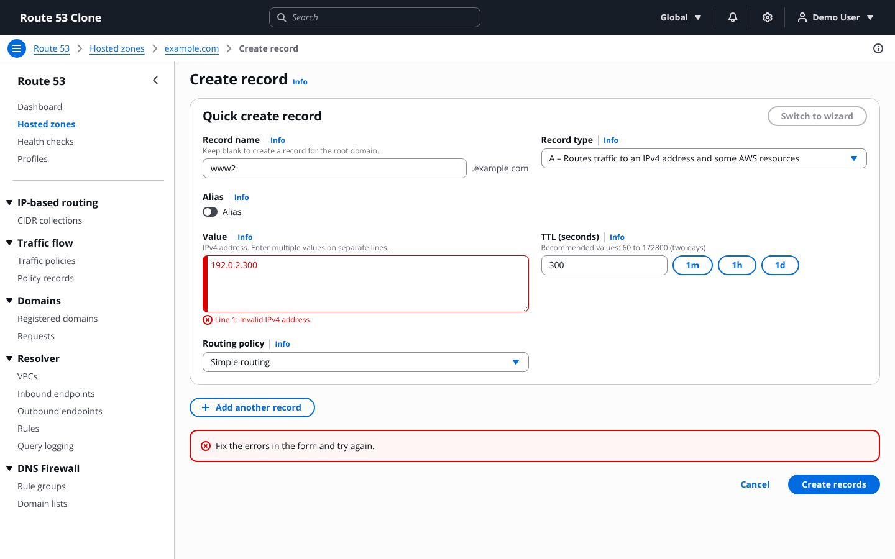
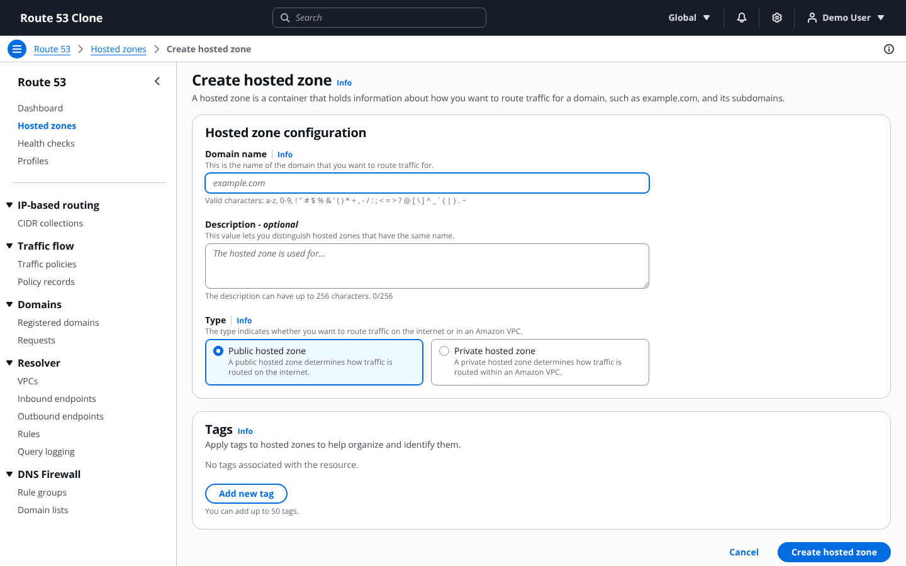
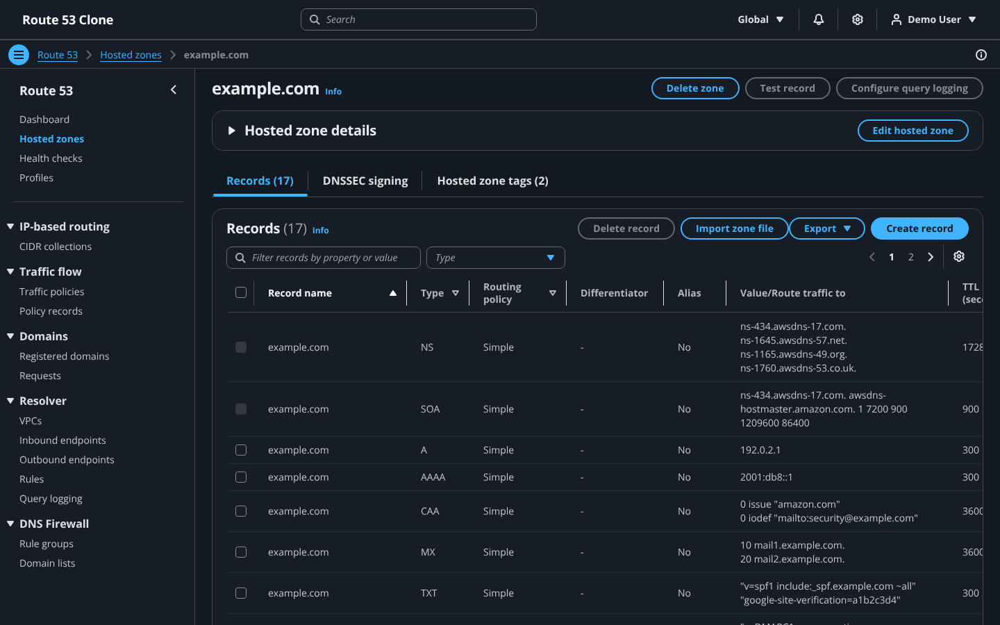
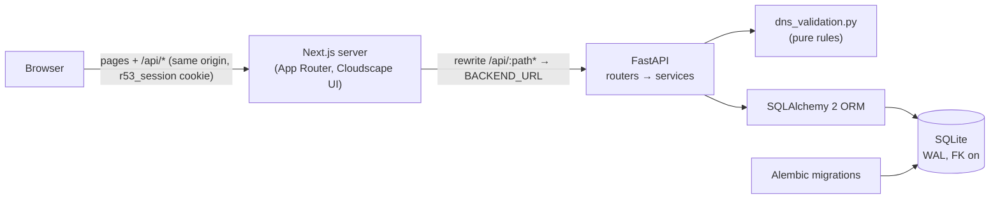
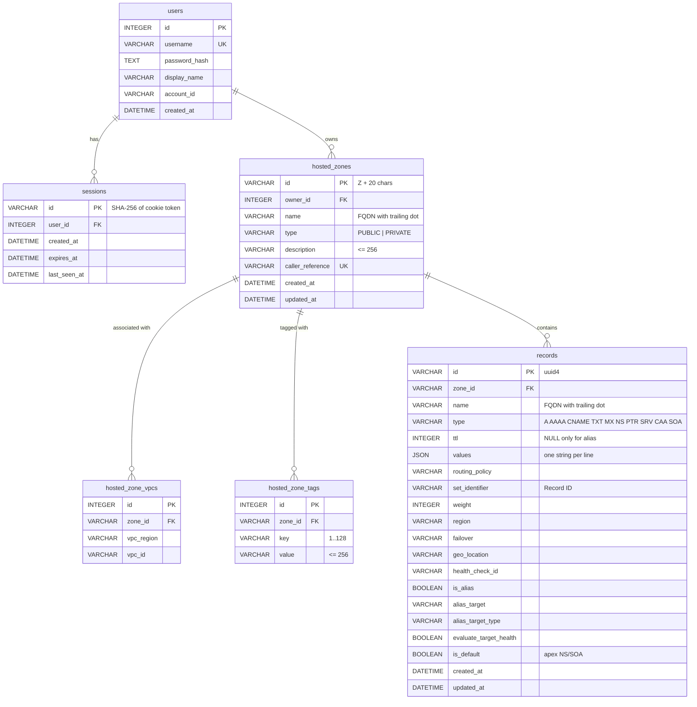

# Route 53 Clone

A functional clone of the **Amazon Route 53 console**. You can manage hosted zones and DNS
records with persistent storage. The frontend uses Next.js and AWS's open-source Cloudscape
design system, the backend uses FastAPI, and data is stored in SQLite.

**Live demo:** _<add the deployed URL here>_  
**Demo credentials:** username `demo`, password `demo1234` (mocked authentication; never
enter real AWS credentials)

> Built for the Scaler SDE Fullstack assignment. This project isn't affiliated with Amazon Web
> Services. It deliberately doesn't use the AWS logo or copy the AWS sign-in page.

---

## Screenshots

| Hosted zones | Hosted zone details |
|---|---|
|  |  |
| **Record details (split panel)** | **Create record with inline validation** |
|  |  |
| **Create hosted zone** | **Dark mode** |
|  |  |

---

## Features

### Core (assignment requirements)

| Requirement | Implementation |
|---|---|
| Mocked login, logout, session persistence | `/login` page; HttpOnly `r53_session` cookie; server-side sessions with a sliding 7-day expiry; you stay signed in after a reload or a browser restart |
| Hosted zones: view, search, create, edit, delete | Full-page table with search, property filters, sorting and pagination; create page (public/private, VPCs, tags); edit page; delete confirmation where you type `delete` |
| DNS records: A, AAAA, CNAME, TXT, MX, NS, PTR, SRV, CAA | Records table, *Create record* (quick create), edit in the split panel, delete modal; per-type validation on both client and server |
| Persistent storage | SQLite with Alembic migrations; Docker/Railway use a mounted volume |
| Route 53 experience | Console navigation, breadcrumbs, help panel ("Info" links), tables, forms, search, filters, pagination, modals and Flashbar notifications |
| Placeholders | "Coming soon" pages for Dashboard, Health checks, Profiles, CIDR collections, Traffic policies, Policy records, Registered domains, Requests, Resolver (all sub-pages) and DNS Firewall |
| IAM / account mocked | Account ID `1234-5678-9012` in the user menu (click to copy); "Global" region selector |

### Bonus (all implemented)

| Bonus | Implementation |
|---|---|
| BIND import | *Import zone file* modal (paste or upload). Errors are reported per line, the import is atomic, and apex SOA/NS and unsupported types are skipped with a reason |
| Export | *Export* dropdown → **JSON** (Route 53-style field names) or **BIND zone file** |
| Dark mode | Settings → Theme: Light / Dark / System. Saved, applied before first paint, and toggled with `Shift+D` |
| Keyboard shortcuts | `?` opens the list. `/` focuses the filter, `Alt+S` focuses search, `c` creates, `g h` / `g d` navigate, `Delete` deletes the selected records, `Esc` closes the split panel |
| Bulk operations | Multi-select record delete (atomic), multi-record create ("Add another record") and zone file import |

---

## Tech stack

| Layer | Technology |
|---|---|
| Frontend | Next.js 15 (App Router), React 19, TypeScript (strict), [Cloudscape Design System](https://cloudscape.design) |
| Backend | Python 3.12, FastAPI, Pydantic v2, pydantic-settings |
| Database | SQLite (WAL mode, foreign keys on), SQLAlchemy 2 typed ORM, Alembic |
| Tests | pytest (backend: API, domain rules, BIND parser), Playwright (end-to-end) |
| Tooling | ruff, mypy `--strict`, ESLint, Prettier, `tsc --noEmit`, GitHub Actions, Docker Compose |

---

## Setup instructions

### Prerequisites

* **Python 3.12** and [**uv**](https://docs.astral.sh/uv/) (or plain `pip`; see below)
* **Node.js 20+** (22 recommended) and npm
* Optional: Docker with Docker Compose

### 1. Backend (http://localhost:8000)

```bash
cd backend
uv sync                          # creates .venv with app + dev dependencies
cp .env.example .env             # optional; defaults work for local development
uv run alembic upgrade head      # creates route53.db
uv run python -m app.seed        # demo user + demo zones (only on an empty database)
uv run uvicorn app.main:app --reload --port 8000
```

Without uv, use `python -m venv .venv`, activate it, run `pip install -r requirements.txt`,
and run the same commands without `uv run`.

Interactive API docs are at **http://localhost:8000/docs**.

### 2. Frontend (http://localhost:3000)

```bash
cd frontend
npm ci
cp .env.example .env.local       # BACKEND_URL=http://localhost:8000
npm run dev
```

Open http://localhost:3000 and sign in with `demo` / `demo1234`.

### 3. Or run everything with Docker Compose

```bash
docker compose up --build
```

This serves the frontend at http://localhost:3000 and the API at http://localhost:8000. The
SQLite database is in the named volume `route53-data`, so it survives `docker compose down`
and `up`. Use `docker compose down -v` to start from a fresh seeded database.

### Environment variables

| Variable | Where | Default | Description |
|---|---|---|---|
| `DATABASE_URL` | backend | `sqlite:///./route53.db` | SQLAlchemy URL. Docker/Railway: `sqlite:////data/route53.db` |
| `CORS_ORIGINS` | backend | `http://localhost:3000` | Comma-separated (or JSON list) origins allowed to call the API directly |
| `COOKIE_SECURE` | backend | `false` | Set `true` in production (HTTPS) to add `Secure` to the session cookie |
| `SESSION_TTL_DAYS` | backend | `7` | Sliding session lifetime |
| `SEED_DEMO_DATA` | backend | `true` | Seed the demo user and zones into an empty database |
| `BACKEND_URL` | frontend (**build time**) | `http://localhost:8000` | Where Next.js proxies `/api/*`. Rewrites are resolved during `next build` |

### Running the tests and checks

```bash
# Backend: lint, types, tests (194 tests)
cd backend
uv run ruff check . && uv run ruff format --check .
uv run mypy app tests
uv run pytest

# Frontend: lint, formatting, types, production build
cd frontend
npm run lint && npm run format:check && npm run typecheck && npm run build

# End-to-end (starts a fresh seeded backend on :8000 and the frontend on :3000 by itself)
npx playwright install chromium     # first time only
npm run test:e2e

# Smoke tests against a deployed instance
BASE_URL=https://your-demo.example npx playwright test --grep @smoke
```

CI (`.github/workflows/ci.yml`) runs every one of these checks, and builds both Docker images,
on each push and pull request.

---

## Architecture overview



### Folder layout

```
backend/
  app/
    main.py            app factory: CORS, routers, exception handlers
    config.py          pydantic-settings (env vars above)
    db.py              engine + session factory; PRAGMA foreign_keys / WAL on every connection
    models.py          typed SQLAlchemy models, constraints and indexes
    schemas/           Pydantic request/response models (auth, hosted_zone, record, common)
    routers/           thin HTTP layer: auth, hosted_zones, records (+ import/export), meta
    services/          business logic: auth_service, zone_service, record_service, bind_io
    dns_validation.py  pure, unit-tested DNS name/value validation for every record type
    errors.py          AppError hierarchy + uniform error responses (incl. 422 override)
    ids.py             Route 53-style zone IDs, deterministic name servers, token hashing
    catalog.py         mocked AWS regions and VPCs
    seed.py            demo data (only into an empty database)
  alembic/versions/0001_initial.py
  tests/               pytest suite + fixtures/sample.zone
frontend/
  src/app/             routes under /route53/v2/... (mirrors the real console URLs) + /login
  src/components/      shell/ (layout, nav, help), hosted-zones/, records/, common/
  src/lib/             api.ts (typed client), types.ts, validation.ts, records.ts, format.ts
  src/hooks/           useApi, useUrlQuery, usePreferences, useShortcuts, useFlash, …
  src/context/         Auth, Flash, Theme, Shell (help panel, shortcuts, page actions)
  src/middleware.ts    redirects console pages to /login when there is no session cookie
  e2e/                 Playwright tests
```

### Request lifecycle

1. The browser calls `/api/...` on the **frontend origin**.
2. The Next.js rewrite proxies the request to FastAPI.
3. The `get_current_user` dependency hashes the cookie token, loads the session and slides
   its expiry.
4. The router calls a service. The service validates (pure `dns_validation` plus contextual
   rules) and writes in one transaction.
5. Errors use one JSON shape (below), which the typed client turns into an `ApiError`. The UI
   shows them as Flashbar messages or as inline errors on the right field (`field_errors`).

### Authentication and session design

* Passwords are hashed with PBKDF2-HMAC-SHA256, using a per-user salt and 240k iterations
  (standard library only).
* At login the server creates a random 256-bit token. Only its **SHA-256** is stored in
  `sessions`, and the raw token lives in the `r53_session` cookie (`HttpOnly`,
  `SameSite=Lax`, `Path=/`, `Max-Age=604800`, `Secure` in production).
* Sessions slide. A request more than a minute after the last one pushes `expires_at` to
  now + 7 days and re-issues the cookie.
* Logout deletes the session row. An expired or unknown cookie gets a 401 that also clears the
  cookie.
* The frontend has two layers. `middleware.ts` redirects cookie-less requests to
  `/login?next=…`, and `AuthContext` checks `/api/auth/me`, so an expired cookie also lands
  on the login page.

### Why Cloudscape?

Cloudscape is the open-source (Apache-2.0) design system that the AWS console itself is built
with. Using its `AppLayoutToolbar`, `Table`, `PropertyFilter`, `SplitPanel`, `Modal`,
`Flashbar` and the rest gives the same look, spacing, keyboard behaviour, accessibility and
dark mode as Route 53, without hand-made lookalike components or CSS overrides.

### Why same-origin rewrites?

The browser never talks to the backend's domain directly, so the session cookie stays
**first-party** in production: no third-party-cookie blocking (Safari ITP), no
`SameSite=None`, and no CORS preflights. CORS is only configured for local tools that call
the API directly.

---

## Database schema



| Table | Purpose and constraints |
|---|---|
| `users` | Demo accounts. `username` is unique. `account_id` is the mocked 12-digit AWS account. |
| `sessions` | One row per login. The PK is the token hash. FK → `users` with `ON DELETE CASCADE`. |
| `hosted_zones` | Zones are scoped to `owner_id`, so other users' zones return 404. CHECK `type IN ('PUBLIC','PRIVATE')`, CHECK `length(description) <= 256`, UNIQUE `caller_reference`, index `(owner_id, name)`. Duplicate zone names are allowed, as in Route 53. |
| `hosted_zone_vpcs` | VPC associations of private zones. UNIQUE `(zone_id, vpc_region, vpc_id)`, cascade delete. |
| `hosted_zone_tags` | UNIQUE `(zone_id, key)`, key 1–128 and value ≤ 256 enforced by CHECKs, cascade delete. The 50-tag limit is enforced by the API. |
| `records` | One row per resource record set. UNIQUE `(zone_id, name, type, set_identifier)`. Indexes `(zone_id, type)` and `(zone_id, name)`. CHECKs on type, routing policy, TTL range (0–2147483647), weight (0–255), failover values, "TTL required unless alias" and "alias needs a target". |

**Default records:** creating a zone also inserts the apex **NS** record (TTL 172800, four
`ns-N.awsdns-NN.{com,net,org,co.uk}.` servers derived from the zone ID) and the **SOA**
record (TTL 900). They are marked `is_default`. They can be edited (TTL and values) but not
deleted or renamed, and they don't count as "non-required" records when deleting a zone. A
zone's record count is computed with `COUNT(*)` and isn't stored.

All timestamps are stored in UTC. Every connection enables `PRAGMA foreign_keys=ON` and
`journal_mode=WAL`. The test suite checks that the Alembic migration matches the models
exactly.

---

## API overview

The full interactive reference is at **`/docs`** (Swagger UI) or `/openapi.json`. Every route
except login and health requires the session cookie. In OpenAPI, every route has a summary, a
tag and documented error responses.

| Method | Path | Description |
|---|---|---|
| GET | `/api/health` | Liveness check |
| POST | `/api/auth/login` | `{username, password}` → sets the `r53_session` cookie, returns the user |
| POST | `/api/auth/logout` | Deletes the session and clears the cookie (204) |
| GET | `/api/auth/me` | Current user, or 401 |
| GET | `/api/hosted-zones` | List zones (search, filters, sort, pagination) |
| POST | `/api/hosted-zones` | Create a zone (default NS + SOA are added) → 201 |
| GET | `/api/hosted-zones/{zone_id}` | Zone details incl. `name_servers`, `record_count`, `vpcs`, `tags` |
| PATCH | `/api/hosted-zones/{zone_id}` | Edit `description` and (private zones) `vpcs` |
| PUT | `/api/hosted-zones/{zone_id}/tags` | Replace the tag set |
| DELETE | `/api/hosted-zones/{zone_id}` | 204, or 400 `HostedZoneNotEmpty` |
| GET | `/api/hosted-zones/{zone_id}/records` | List records (search, filters, sort, pagination) |
| POST | `/api/hosted-zones/{zone_id}/records` | Atomic batch create `{records: [...]}` → 201 `{items}` |
| GET | `/api/hosted-zones/{zone_id}/records/{record_id}` | One record |
| PUT | `/api/hosted-zones/{zone_id}/records/{record_id}` | Replace a record (same validation as create) |
| DELETE | `/api/hosted-zones/{zone_id}/records/{record_id}` | 204 (default NS/SOA → 400) |
| POST | `/api/hosted-zones/{zone_id}/records/bulk-delete` | Atomic `{ids: [...]}` |
| POST | `/api/hosted-zones/{zone_id}/import` | `{zone_file}` → `{created, skipped, errors}`; any error → 400, nothing inserted |
| GET | `/api/hosted-zones/{zone_id}/export?format=json\|bind` | File download (`<zone>.json` / `<zone>.zone`) |
| GET | `/api/meta/regions` | Mocked AWS regions |
| GET | `/api/meta/vpcs?region=` | Mocked VPCs for private zones |

### Pagination, sorting and filters

List endpoints return `{"items": [...], "total": n, "page": p, "page_size": s}` and accept:

* `page` (from 1) and `page_size` (`10`, `25`, `50` or `100`; default 10)
* `sort_by` and `sort_order` (`asc` | `desc`)
* `search`: case-insensitive substring search
* Hosted zones: `type` (`PUBLIC`/`PRIVATE`), `name`, `description`, `id`; sort by `name`,
  `type`, `record_count`, `description`, `id` or `created_at`
* Records: `type` (repeatable: `type=A&type=MX`), `routing_policy` (repeatable), `alias`
  (`true`/`false`), `name`, `value`; sort by `name`, `type`, `ttl` or `routing_policy`.
  Without `sort_by`, records are in canonical DNS order: zone apex first, and NS and SOA first
  within a name, like the console.

### Error contract

Every non-2xx response has the same shape:

```json
{
  "error": {
    "code": "InvalidChangeBatch",
    "message": "Tried to create resource record set [name='www.example.com.', type='A'] but it already exists",
    "field_errors": { "records[0].name": "Tried to create resource record set [...] but it already exists" }
  }
}
```

| Code | HTTP | When |
|---|---|---|
| `ValidationError` | 422 | Malformed request (wrong types, out-of-range TTL, bad page size…) |
| `InvalidChangeBatch` | 400 / 409 | Business-rule violations / duplicates |
| `HostedZoneNotEmpty` | 400 | Deleting a zone with non-default records |
| `NoSuchHostedZone`, `NoSuchRecord` | 404 | Unknown ID, or one owned by another user |
| `Unauthorized`, `InvalidCredentials` | 401 | Missing or expired session / wrong password |

`field_errors` keys point at the exact input, such as `records[1].values[0]`, `vpcs[0].vpc_id`
or `line 12` for zone file imports. The UI uses them to show the error next to the right
field and line.

### curl examples

```bash
# 1. Log in and keep the session cookie in a cookie jar
curl -c cookies.txt -H 'Content-Type: application/json' \
  -d '{"username":"demo","password":"demo1234"}' \
  http://localhost:8000/api/auth/login

# 2. Create a hosted zone
curl -b cookies.txt -H 'Content-Type: application/json' \
  -d '{"name":"my-site.com","description":"Created with curl","type":"PUBLIC"}' \
  http://localhost:8000/api/hosted-zones

# 3. Create two records in one atomic batch (use the zone id from step 2)
curl -b cookies.txt -H 'Content-Type: application/json' \
  -d '{"records":[{"name":"www","type":"A","ttl":300,"values":["192.0.2.10"]},
                  {"name":"","type":"MX","values":["10 mail.my-site.com"]}]}' \
  http://localhost:8000/api/hosted-zones/<ZONE_ID>/records
```

---

## Route 53 behaviours replicated

* **Immutable name and type.** A hosted zone's domain name and its public/private type can't
  be changed after creation. Editing covers the description, tags and VPC associations.
* **Delete only when empty.** A zone can be deleted only when it contains nothing but its
  default NS and SOA records. Otherwise the API returns Route 53's exact message: *"The
  specified hosted zone contains non-required resource record sets and so cannot be
  deleted."*
* **Default NS/SOA.** These records are created with every zone. They can be edited but not
  deleted (*"A HostedZone must contain at least one NS record for the zone itself."* /
  *"…exactly one SOA record."*).
* **CNAME rules.** A CNAME takes exactly one value, isn't allowed at the zone apex, and can't
  coexist with any other record of the same name, in either direction.
* **Duplicates.** Creating a record set that already exists gives *"Tried to create resource
  record set [name='…', type='…'] but it already exists"* (409).
* **Alias records.** Allowed for A, AAAA and CNAME, including at the apex. They have no TTL
  and no values. Targets can be another record in the zone (validated), CloudFront, an S3
  website, an ELB or API Gateway (mocked endpoints).
* **Routing policies.** Simple, Weighted, Geolocation, Latency, Failover and Multivalue
  answer. Non-simple records need a Record ID (set identifier) plus their policy-specific
  field. All records with the same name and type must use the same policy, and a failover
  pair has at most one primary and one secondary.
* **Atomic changes.** A batch create, a bulk delete or an import either fully succeeds or
  changes nothing.
* **Value formats** for each type: IPv4, IPv6 (normalized), domain names, TXT strings of up to
  255 characters each (auto-quoted), `priority host` for MX, `priority weight port target`
  for SRV, and `flags tag "value"` for CAA.

## Mocked sections

* **Authentication / IAM:** one demo user. The account ID is shown in the user menu.
* **Regions and VPCs:** a fixed catalogue (`backend/app/catalog.py`) used by the private zone
  form and latency routing.
* **Health checks:** a Health check ID can be entered as free text. The Health checks page is
  "Coming soon".
* **Alias targets for AWS resources:** example endpoints are suggested, and any valid domain
  name is accepted.
* **Placeholder pages:** Dashboard, Health checks, Profiles, CIDR collections, Traffic
  policies, Policy records, Registered domains, Requests, Resolver and DNS Firewall. The
  "Test record", "Configure query logging", "DNSSEC signing" and "Switch to wizard" controls
  are visible but disabled.

## Design decisions and trade-offs

* **SQLite and a single worker.** This satisfies the persistence requirement with no extra
  infrastructure. WAL mode lets reads continue during writes, but SQLite has one writer, so
  the API runs one uvicorn worker. Postgres would only need a new `DATABASE_URL` and driver.
* **Server-side tables.** Search, filters, sorting and pagination all run in the API, and the
  table state is kept in the URL (shareable links, the Back button works). Records are sorted
  in canonical DNS order in Python, which is simpler than expressing it in SQL and fine for
  the number of records a zone holds.
* **Validation in two places.** The backend (`dns_validation.py` plus the services) is
  authoritative. `frontend/src/lib/validation.ts` mirrors it so users see the same messages
  inline before submitting.
* **Record sets, not individual values.** As in Route 53, one row holds every value of a
  `(name, type, set identifier)`, so the UI shows one value per line.
* **Seeding only runs on an empty database,** so zones a reviewer deletes stay deleted after a
  restart.

## Known limitations

* No real DNS: records aren't served by a name server, and "Test record" isn't implemented.
* Single-user demo: there's no registration or IAM. Ownership scoping is implemented and
  tested with a second user, though.
* BIND export can't express alias records or non-simple routing policies, so these are
  written as `;` comments. The JSON export contains everything.
* The alias target autosuggest for records in the zone lists up to the first 100 records.
* `BACKEND_URL` is read at frontend **build** time, because Next.js resolves rewrites during
  the build.

## Deployment

Step-by-step instructions are in [`docs/DEPLOYMENT.md`](docs/DEPLOYMENT.md). The hosted demo uses two services:

* **Backend:** this repo's `backend/Dockerfile` on **Railway**, with a **persistent volume
  mounted at `/data`** (`backend/railway.json` sets the health check) and these variables: `DATABASE_URL=sqlite:////data/route53.db`,
  `COOKIE_SECURE=true` and `CORS_ORIGINS=<frontend URL>`. On start the container runs
  `alembic upgrade head`, then the seed (a no-op unless the database is empty), then a single
  uvicorn worker. The health check path is `/api/health`.
* **Frontend:** `frontend/` on **Vercel** with `BACKEND_URL=https://<backend host>`. Thanks to
  the rewrite, the browser only ever talks to the Vercel domain.

After deploying, check on the live URL that you can log in, reload and stay signed in, create
a zone and records, reload and still see them, sign out, and get redirected to login from a
protected page. The Playwright `@smoke` tests automate this
(`BASE_URL=<url> npx playwright test --grep @smoke`).
